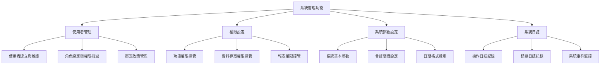
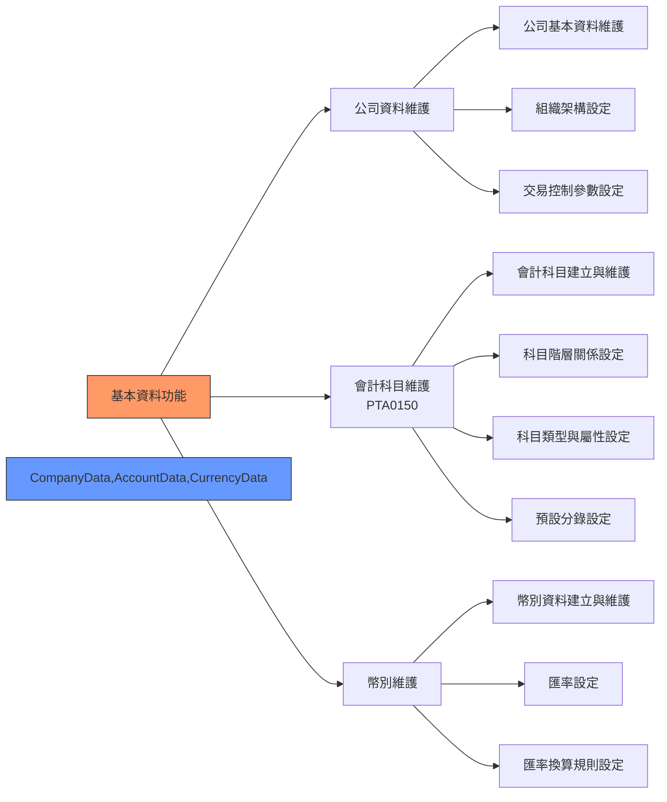
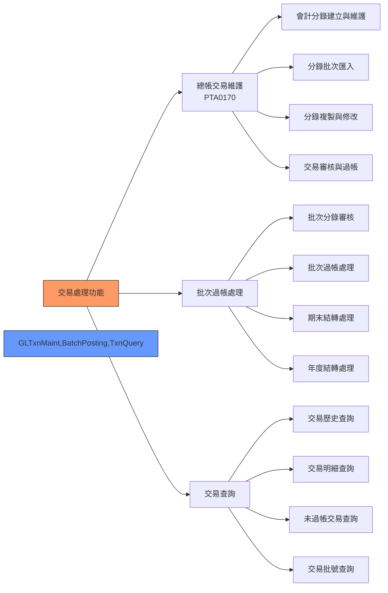
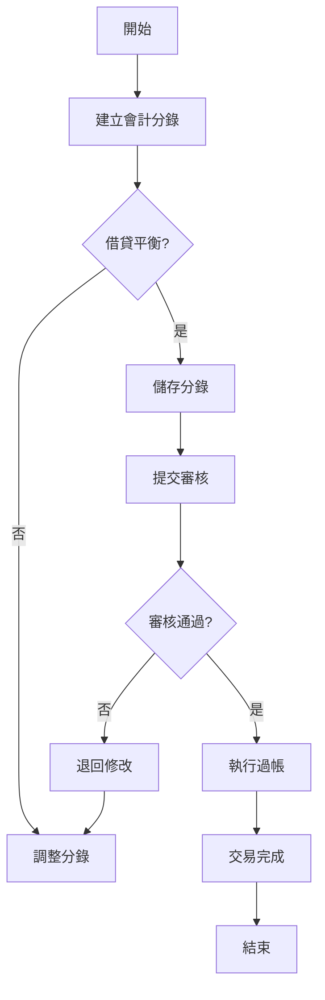
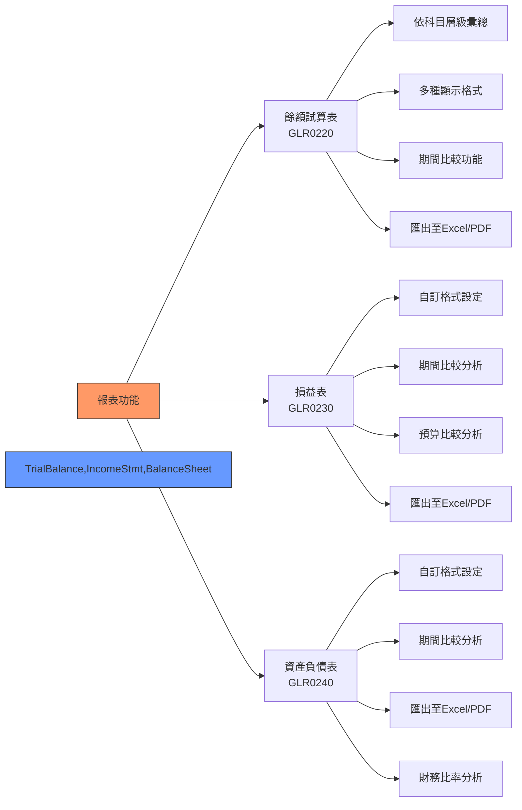
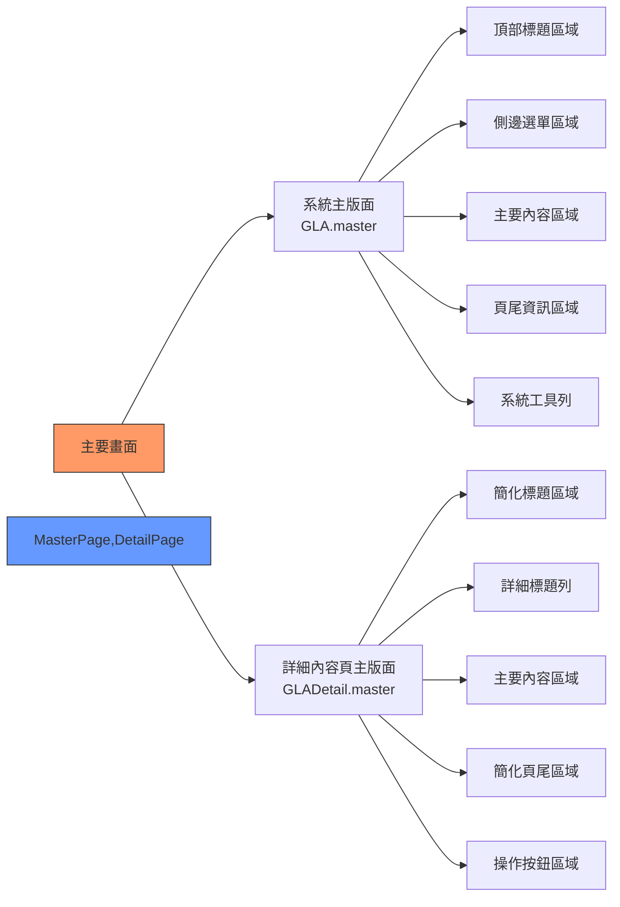

## 4. 主要功能

### 4.1 系統管理功能

<div align="center">



</div>

#### 4.1.1 使用者管理

<div align="center">
  <table>
    <tr>
      <th>功能項目</th>
      <th>功能說明</th>
      <th>操作頻率</th>
      <th>使用角色</th>
    </tr>
    <tr>
      <td>使用者建立與維護</td>
      <td>
        - 新增使用者帳號<br>
        - 編輯使用者資料<br>
        - 停用/啟用使用者<br>
        - 使用者資料查詢
      </td>
      <td>低<br>(as needed)</td>
      <td>系統管理員</td>
    </tr>
    <tr>
      <td>角色設定與權限指派</td>
      <td>
        - 建立角色<br>
        - 設定角色權限<br>
        - 指派使用者角色<br>
        - 角色權限查詢
      </td>
      <td>低<br>(as needed)</td>
      <td>系統管理員</td>
    </tr>
    <tr>
      <td>密碼政策管理</td>
      <td>
        - 密碼複雜度要求<br>
        - 密碼有效期限<br>
        - 密碼更換提醒<br>
        - 密碼重置
      </td>
      <td>低<br>(as needed)</td>
      <td>系統管理員</td>
    </tr>
  </table>
</div>

<div align="center">

```
+----------------------------------------------------+
|                 使用者管理畫面                      |
+----------------------------------------------------+
| [新增] [修改] [刪除] [查詢] [匯出]                  |
+----------------------------------------------------+
| 使用者ID | 使用者名稱 | 所屬部門 | 角色  | 狀態     |
|---------|-----------|---------|-------|---------|
| USER001 | 王小明    | 財務部   | 會計員 | 啟用     |
| USER002 | 李大華    | 財務部   | 主管   | 啟用     |
| USER003 | 張三      | 稽核部   | 稽核員 | 停用     |
+----------------------------------------------------+
| << 第1頁/共10頁 >>   每頁顯示: [10 ▼] 總筆數: 29   |
+----------------------------------------------------+
```

</div>

#### 4.1.2 權限設定

<div align="center">
  <table>
    <tr>
      <th>功能項目</th>
      <th>功能說明</th>
      <th>操作頻率</th>
      <th>使用角色</th>
    </tr>
    <tr>
      <td>功能權限控管</td>
      <td>
        - 模組功能權限<br>
        - 操作按鈕權限<br>
        - 批次作業權限<br>
        - 報表產生權限
      </td>
      <td>低<br>(as needed)</td>
      <td>系統管理員</td>
    </tr>
    <tr>
      <td>資料存取權限控管</td>
      <td>
        - 公司資料存取權限<br>
        - 科目資料存取權限<br>
        - 交易資料存取權限<br>
        - 報表資料存取權限
      </td>
      <td>低<br>(as needed)</td>
      <td>系統管理員</td>
    </tr>
    <tr>
      <td>報表權限控管</td>
      <td>
        - 報表檢視權限<br>
        - 報表匯出權限<br>
        - 報表列印權限<br>
        - 報表格式設定權限
      </td>
      <td>低<br>(as needed)</td>
      <td>系統管理員</td>
    </tr>
  </table>
</div>

<div align="center">

```
+--------------------------------------------+
|            權限管理設定畫面                |
+--------------------------------------------+
| 角色: [會計人員▼]                          |
+--------------------------------------------+
| ✓ 基本資料模組                             |
|   ✓ 會計科目維護                           |
|     ✓ 查詢權限                             |
|     ✓ 新增權限                             |
|     ✓ 修改權限                             |
|     ☐ 刪除權限                             |
|   ✓ 幣別維護                               |
|     ✓ 查詢權限                             |
|     ☐ 新增權限                             |
|     ☐ 修改權限                             |
|     ☐ 刪除權限                             |
| ✓ 交易處理模組                             |
|   ...                                      |
+--------------------------------------------+
| [儲存] [取消] [複製權限]                   |
+--------------------------------------------+
```

</div>

### 4.2 基本資料功能

<div align="center">



</div>

#### 4.2.1 公司資料維護

<div align="center">

```
+-------------------------------------------------------------+
|                     公司資料維護畫面                         |
+-------------------------------------------------------------+
| [基本資料] [組織架構] [交易控制]                             |
+-------------------------------------------------------------+
| 公司代碼: [PANT01]                                          |
| 公司名稱: [泛太公司                                      ]   |
| 統一編號: [12345678]                                        |
| 公司地址: [台北市信義區信義路五段7號                     ]   |
| 聯絡電話: [02-12345678]                                     |
| 傳真號碼: [02-87654321]                                     |
| 電子郵件: [contact@panpacific.com.tw                    ]   |
| 公司網站: [https://www.panpacific.com.tw                ]   |
| 成立日期: [2000/01/01]                                      |
| 公司狀態: [✓] 使用中                                         |
| 備註說明: [                                              ]   |
|           [                                              ]   |
+-------------------------------------------------------------+
| [儲存] [取消] [回上頁]                                       |
+-------------------------------------------------------------+
```

</div>

#### 4.2.2 會計科目維護 (PTA0150)

<div align="center">

```
+-------------------------------------------------------------+
|                     會計科目維護畫面                         |
+-------------------------------------------------------------+
| [新增] [修改] [刪除] [查詢] [匯出] [匯入]                     |
+-------------------------------------------------------------+
| 科目代碼 | 科目名稱     | 科目類型    | 上層科目  | 餘額方向 | 狀態 |
|---------|-------------|------------|-----------|---------|------|
| 1000    | 流動資產     | 資產       |           | 借方    | 使用中 |
| 1001    | 現金        | 資產       | 1000      | 借方    | 使用中 |
| 1002    | 銀行存款     | 資產       | 1000      | 借方    | 使用中 |
| 2000    | 流動負債     | 負債       |           | 貸方    | 使用中 |
| 2001    | 應付帳款     | 負債       | 2000      | 貸方    | 使用中 |
+-------------------------------------------------------------+
| << 第1頁/共5頁 >>   每頁顯示: [10 ▼] 總筆數: 42             |
+-------------------------------------------------------------+
```

</div>

<div align="center">

```
科目階層關係示意圖:

1000 流動資產
│
├── 1001 現金
│
├── 1002 銀行存款
│   │
│   ├── 1002.01 台灣銀行
│   │
│   └── 1002.02 國泰世華
│
└── 1003 應收帳款
    │
    ├── 1003.01 一般客戶
    │
    └── 1003.02 關係企業
```

</div>

### 4.3 交易處理功能

<div align="center">



</div>

#### 4.3.1 總帳交易維護 (PTA0170)

<div align="center">

```
+----------------------------------------------------------------------+
|                       總帳交易維護畫面                                |
+----------------------------------------------------------------------+
| [新增] [修改] [刪除] [查詢] [匯入] [審核] [過帳] [複製] [反轉] [匯出]  |
+----------------------------------------------------------------------+
| 分錄表頭:                                                             |
| 交易編號: [TX202311001] 交易日期: [2023/11/05] 過帳狀態: [未過帳]     |
| 來源模組: [總帳    ] 摘要說明: [業務費用記錄                      ]    |
| 建立人員: [USER001 ] 審核狀態: [未審核 ]   附件檔案: [上傳] [檢視]    |
+----------------------------------------------------------------------+
| 分錄明細:                                                             |
| 序號 | 科目代碼 | 科目名稱 | 借方金額  | 貸方金額  | 部門   | 專案    |
|------|---------|---------|-----------|-----------|--------|---------|
| 1    | 6001    | 水電費   | 5,000.00  |           | 行政部 |         |
| 2    | 6002    | 辦公用品 | 3,500.00  |           | 行政部 |         |
| 3    | 1002    | 銀行存款 |           | 8,500.00  | 財務部 |         |
|      |         |         |           |           |        |         |
|      |         |         |           |           |        |         |
| 合計:          |         | 8,500.00  | 8,500.00  |        |         |
+----------------------------------------------------------------------+
| [新增明細] [修改明細] [刪除明細] [上移] [下移]                         |
+----------------------------------------------------------------------+
| 借貸差額: 0.00    | 狀態: 平衡                                         |
+----------------------------------------------------------------------+
```

</div>

<div align="center">



</div>

### 4.4 報表功能

<div align="center">



</div>

#### 4.4.1 餘額試算表 (GLR0220)

<div align="center">

```
+----------------------------------------------------------------------+
|                         餘額試算表                                    |
|                    2023年10月01日 至 10月31日                         |
+----------------------------------------------------------------------+
| 科目層級: [全部▼] 顯示格式: [標準格式▼] [√] 隱藏零餘額科目            |
+----------------------------------------------------------------------+
| 科目代碼 | 科目名稱      | 期初餘額    | 本期借方    | 本期貸方    | 期末餘額    |
|---------|--------------|------------|------------|------------|------------|
| 1000    | 流動資產      | 2,560,000  | 350,000    | 120,000    | 2,790,000  |
| 1001    | 現金          | 120,000    | 35,000     | 45,000     | 110,000    |
| 1002    | 銀行存款      | 1,450,000  | 285,000    | 60,000     | 1,675,000  |
| 1003    | 應收帳款      | 990,000    | 30,000     | 15,000     | 1,005,000  |
|         |              |            |            |            |            |
| 2000    | 流動負債      | 1,250,000  | 120,000    | 180,000    | 1,310,000  |
| 2001    | 應付帳款      | 850,000    | 95,000     | 140,000    | 895,000    |
| 2002    | 預收款項      | 400,000    | 25,000     | 40,000     | 415,000    |
|         |              |            |            |            |            |
| 3000    | 業主權益      | 1,310,000  | 0          | 170,000    | 1,480,000  |
| 3001    | 資本          | 1,000,000  | 0          | 0          | 1,000,000  |
| 3002    | 保留盈餘      | 310,000    | 0          | 170,000    | 480,000    |
+----------------------------------------------------------------------+
| 借貸方合計               | 2,560,000  | 470,000    | 470,000    | 2,790,000  |
+----------------------------------------------------------------------+
| [匯出Excel] [匯出PDF] [列印] [傳送郵件]      產生日期: 2023/11/05     |
+----------------------------------------------------------------------+
```

</div>

## 5. 畫面規格

### 5.1 主要畫面

<div align="center">



</div>

#### 5.1.1 系統主版面 (GLA.master)

<div align="center">

```
+------------------------------------------------------------------+
|                         泛太總帳系統                              |
|                                                                  |
| 使用者: 王小明 | 角色: 會計人員 | 系統時間: 2023/11/05 10:30:15   |
+------------------+-----------------------------------------------+
|                  |                                               |
| ● 系統管理       |                                               |
|   ○ 使用者管理   |                                               |
|   ○ 權限設定     |                                               |
|   ○ 系統參數     |                                               |
|   ○ 系統日誌     |                                               |
|                  |                                               |
| ● 基本資料       |                                               |
|   ○ 公司資料     |                主要內容顯示區域                |
|   ○ 會計科目     |                                               |
|   ○ 幣別維護     |                                               |
|                  |                                               |
| ● 交易處理       |                                               |
|   ○ 總帳交易     |                                               |
|   ○ 批次過帳     |                                               |
|   ○ 交易查詢     |                                               |
|                  |                                               |
| ● 報表           |                                               |
|   ○ 餘額試算表   |                                               |
|   ○ 損益表       |                                               |
|   ○ 資產負債表   |                                               |
|                  |                                               |
+------------------+-----------------------------------------------+
|                    版權所有 © 2023 泛太公司                       |
+------------------------------------------------------------------+
```

</div>

#### 5.1.2 詳細內容頁主版面 (GLADetail.master)

<div align="center">

```
+------------------------------------------------------------------+
| 泛太總帳系統 - 詳細內容                          [關閉] [回首頁]  |
+------------------------------------------------------------------+
|                   會計科目維護 - 編輯科目                         |
+------------------------------------------------------------------+
|                                                                  |
|                                                                  |
|                                                                  |
|                                                                  |
|                                                                  |
|                     詳細內容顯示與編輯區域                        |
|                                                                  |
|                                                                  |
|                                                                  |
|                                                                  |
|                                                                  |
|                                                                  |
+------------------------------------------------------------------+
|                                                                  |
|             [儲存] [取消] [刪除] [回上頁] [相關操作...]           |
|                                                                  |
+------------------------------------------------------------------+
```

</div> 