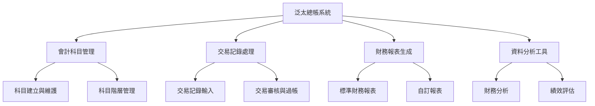
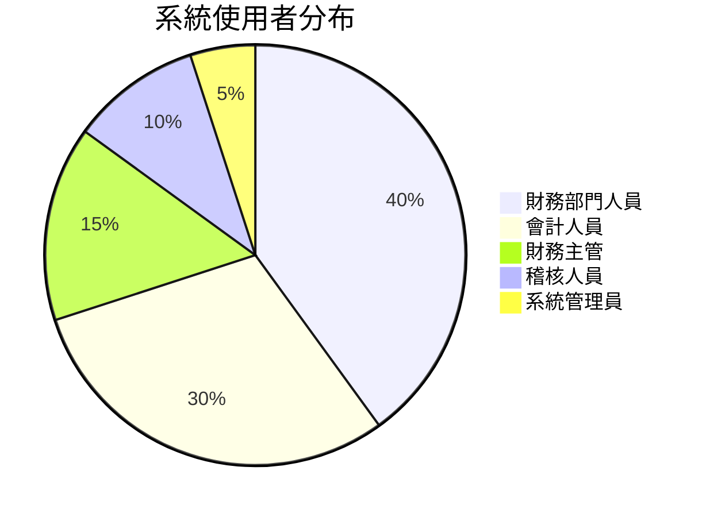
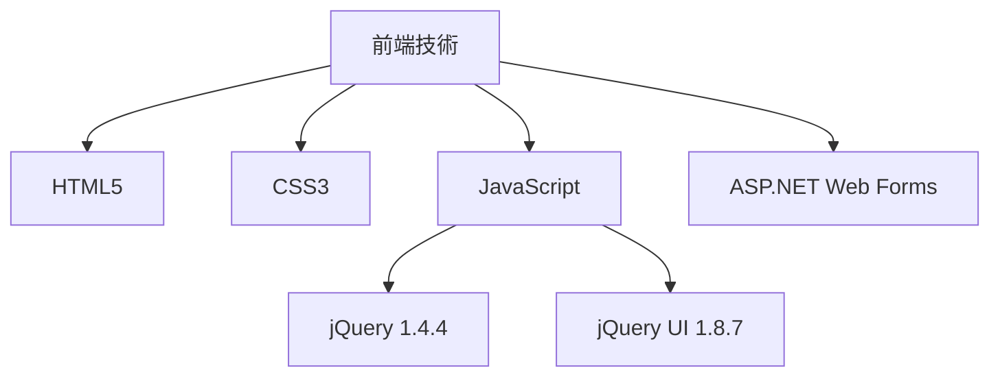
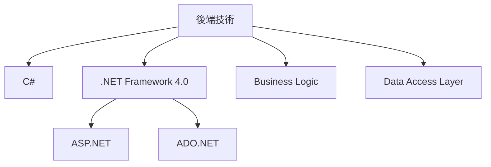
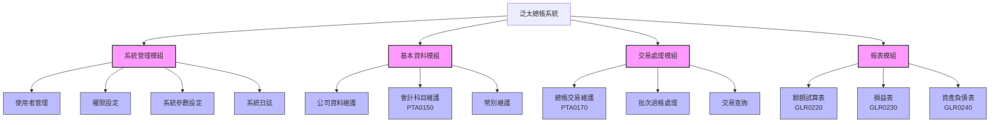
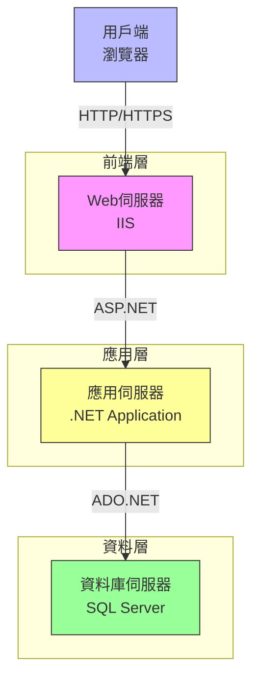
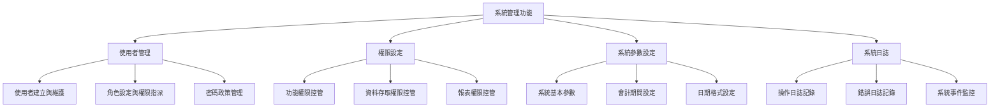
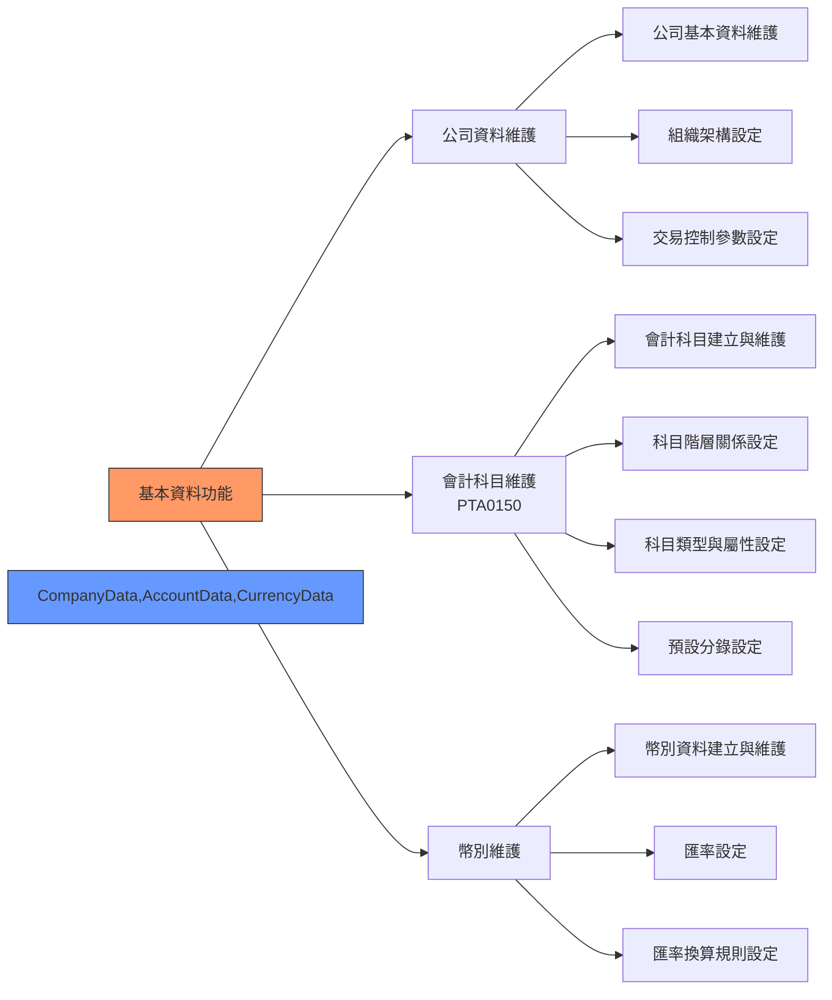
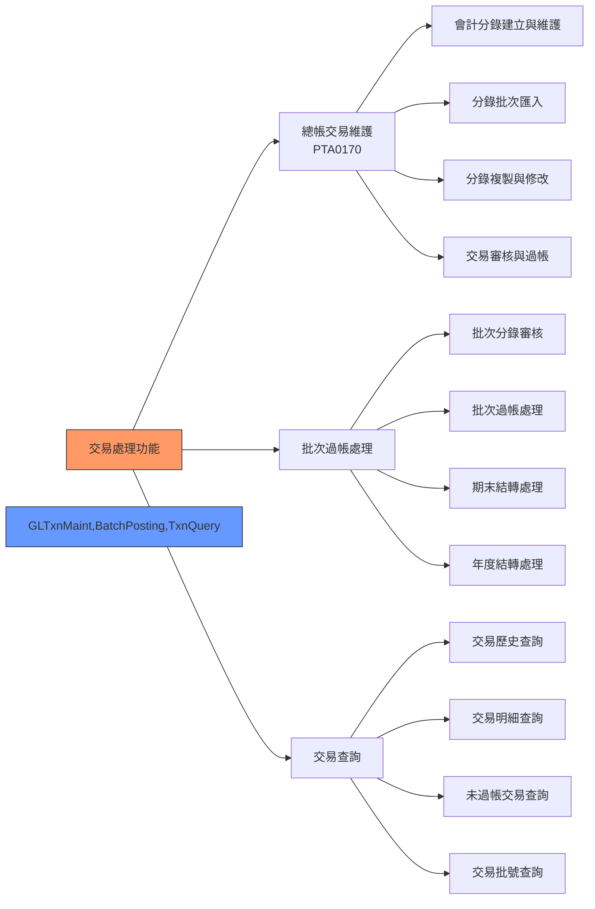
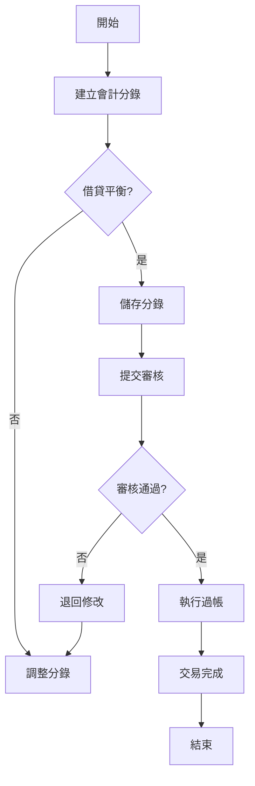

# 泛太總帳系統規格書 (純Markdown版)

```
+---------------------------+
|      泛太總帳系統         |
|      GLATEST 1.0.0        |
+---------------------------+
```

## 1. 基本資訊

| 項目 | 說明 |
|-----|------|
| 系統名稱 | 泛太總帳系統 |
| 系統代號 | GLATEST |
| 版本號碼 | 1.0.0 |
| 建立日期 | 2023/11/05 |
| 建立人員 | PanPacific開發團隊 |
| 最後修改日期 | 2023/11/05 |
| 最後修改人員 | PanPacific開發團隊 |

## 2. 系統概述

### 2.1 系統目的

泛太總帳系統旨在提供完整的財務會計管理解決方案，支援企業進行會計科目管理、交易記錄、財務報表生成及分析等功能。系統以Web架構實現，確保使用者可透過瀏覽器便捷存取，並提供高度客製化的報表與分析工具。

<div align="center">



</div>

### 2.2 系統特點

<div align="center">
  <table>
    <tr>
      <td align="center">🌐<br>Web架構</td>
      <td align="center">🔄<br>多層架構</td>
      <td align="center">📊<br>會計週期管理</td>
      <td align="center">📈<br>豐富報表</td>
    </tr>
    <tr>
      <td align="center">🌍<br>多語系支援</td>
      <td align="center">🔐<br>權限管理</td>
      <td align="center">💾<br>資料維護</td>
      <td align="center">🔒<br>安全控管</td>
    </tr>
  </table>
</div>

1. **基於ASP.NET框架開發的Web應用程式**
   - 支援跨瀏覽器操作
   - 無需安裝用戶端軟體
   - 統一的部署與升級管理

2. **採用多層架構設計**
   - 表現層 (UI Layer)
   - 業務邏輯層 (Business Logic Layer)
   - 資料存取層 (Data Access Layer)
   - 確保系統可維護性與擴展性

3. **支援完整的會計週期管理**
   - 會計年度設定
   - 期間管理
   - 交易記錄
   - 結轉處理
   - 財務報表產生

4. **提供豐富的財務報表與分析工具**
   - 標準會計報表
   - 自訂報表功能
   - 圖表分析工具
   - 匯出多種格式

5. **多語系支援（繁體中文/英文）**
   - 使用者介面多語系切換
   - 報表多語系輸出
   - 資料多語系維護

6. **整合式的使用者權限管理**
   - 角色型權限控制
   - 功能層級權限
   - 資料層級權限
   - 操作稽核記錄

7. **完善的資料維護與查詢功能**
   - 直覺化的操作介面
   - 彈性化的查詢條件
   - 批次資料處理
   - 資料匯入/匯出

8. **資料安全性控管**
   - 加密傳輸
   - 敏感資料保護
   - 資料庫安全備份
   - 操作日誌追蹤

### 2.3 使用對象

<div align="center">


</div>

| 使用者角色 | 主要職責 | 使用系統功能 |
|----------|---------|------------|
| **財務部門人員** | 日常財務資料處理 | 交易維護、資料查詢、報表產生 |
| **會計人員** | 會計資料錄入與維護 | 科目維護、分錄處理、報表審核 |
| **財務主管** | 財務決策與審核 | 報表分析、交易審核、績效評估 |
| **稽核人員** | 財務資料查核與稽核 | 查詢功能、稽核報表、歷史記錄 |
| **系統管理員** | 系統設定與維護 | 使用者管理、權限設定、系統參數 |

## 3. 系統架構

### 3.1 技術架構

<div align="center">

```
+------------------+     +------------------+     +------------------+
|    表現層        |     |   業務邏輯層     |     |   資料存取層     |
| Presentation     |---->|   Business       |---->|   Data Access    |
|    Layer         |     |   Logic Layer    |     |     Layer        |
+------------------+     +------------------+     +------------------+
        |                       |                        |
        v                       v                        v
+------------------+     +------------------+     +------------------+
|   使用者介面     |     |   業務處理       |     |   資料庫存取     |
|   UI Components  |     |   Processing     |     |   Database       |
+------------------+     +------------------+     +------------------+
```

</div>

#### 3.1.1 前端技術



- **HTML5**：頁面結構與內容
- **CSS3**：視覺呈現與版面布局
  - iBOSSiteStyle.css：主要樣式表
  - iBosGridStyle.css：表格樣式表
  - StyleBtn.css：按鈕樣式表
- **JavaScript**：前端互動功能
  - jQuery 1.4.4：DOM操作與AJAX
  - jQuery UI 1.8.7：界面元件與特效
  - ui.datepicker.js：日期選擇功能
  - ui.datepicker.tw.js：民國年日期選擇
- **ASP.NET Web Forms**：頁面框架
  - Master Pages：頁面模板
  - User Controls：共用控制項
  - Validation Controls：資料驗證

#### 3.1.2 後端技術



- **C#**：主要開發語言
- **.NET Framework 4.0**：應用程式框架
  - ASP.NET：Web應用程式框架
  - ADO.NET：資料存取技術
- **Business Logic**：業務邏輯層
  - 交易處理邏輯
  - 資料驗證邏輯
  - 權限檢查邏輯
- **Data Access Layer**：資料存取層
  - SQL命令封裝
  - 交易管理
  - 連接池管理

#### 3.1.3 資料庫

<div align="center">

```
+----------------------------------+
|         Microsoft SQL Server     |
|           版本: 2016+            |
+----------------------------------+
|  +-----------+  +-----------+    |
|  | 資料儲存  |  | 交易管理  |    |
|  +-----------+  +-----------+    |
|                                  |
|  +-----------+  +-----------+    |
|  | 備份恢復  |  | 安全控管  |    |
|  +-----------+  +-----------+    |
+----------------------------------+
```

</div>

- **Microsoft SQL Server**：主要資料庫系統
  - 版本：SQL Server 2016及以上
  - 功能：
    - 資料儲存
    - 交易管理
    - 資料備份與恢復
    - 安全控管

#### 3.1.4 開發環境

<div align="center">

```
+---------------------------+    +---------------------------+
|      Visual Studio        |    |          SSMS             |
|       IDE開發環境          |    |      資料庫管理工具        |
+---------------------------+    +---------------------------+
|  - 程式碼編輯              |    |  - 資料庫設計              |
|  - 除錯工具               |    |  - 查詢工具                |
|  - 部署工具               |    |  - 效能監控                |
+---------------------------+    +---------------------------+
```

</div>

- **Visual Studio**：IDE開發環境
  - 版本：Visual Studio 2019及以上
  - 功能：
    - 程式碼編輯
    - 除錯工具
    - 部署工具
- **SQL Server Management Studio**：資料庫管理工具
  - 版本：SSMS 18.0及以上
  - 功能：
    - 資料庫設計
    - 查詢工具
    - 效能監控 

### 3.2 系統模組

<div align="center">



</div>

#### 3.2.1 系統管理模組

<div align="center">
  <table>
    <tr>
      <td align="center">
        👤<br>
        <b>使用者管理</b><br>
        帳號控管、角色指派
      </td>
      <td align="center">
        🔑<br>
        <b>權限設定</b><br>
        功能、資料存取權限
      </td>
    </tr>
    <tr>
      <td align="center">
        ⚙️<br>
        <b>系統參數設定</b><br>
        會計期間、日期格式
      </td>
      <td align="center">
        📝<br>
        <b>系統日誌</b><br>
        操作記錄、錯誤監控
      </td>
    </tr>
  </table>
</div>

#### 3.2.2 基本資料模組

<div align="center">
  <table>
    <tr>
      <td align="center">
        🏢<br>
        <b>公司資料維護</b><br>
        基本資料、組織架構
      </td>
      <td align="center">
        📒<br>
        <b>會計科目維護</b><br>
        科目管理、階層設定
      </td>
      <td align="center">
        💱<br>
        <b>幣別維護</b><br>
        匯率設定、換算規則
      </td>
    </tr>
  </table>
</div>

#### 3.2.3 交易處理模組

<div align="center">
  <table>
    <tr>
      <td align="center">
        💼<br>
        <b>總帳交易維護</b><br>
        分錄建立、批次匯入
      </td>
      <td align="center">
        📋<br>
        <b>批次過帳處理</b><br>
        審核確認、期末結轉
      </td>
      <td align="center">
        🔍<br>
        <b>交易查詢</b><br>
        歷史查詢、明細瀏覽
      </td>
    </tr>
  </table>
</div>

#### 3.2.4 報表模組

<div align="center">
  <table>
    <tr>
      <td align="center">
        📊<br>
        <b>餘額試算表</b><br>
        科目彙總、期間比較
      </td>
      <td align="center">
        📈<br>
        <b>損益表</b><br>
        收支對比、預算分析
      </td>
      <td align="center">
        📉<br>
        <b>資產負債表</b><br>
        資產負債、比率分析
      </td>
    </tr>
  </table>
</div>

### 3.3 物理架構

<div align="center">



</div>

#### 3.3.1 前端層

<div align="center">

```
+---------------------------------------+
|            Web伺服器 (IIS)            |
+---------------------------------------+
| ✓ HTTP/HTTPS請求處理                  |
| ✓ 靜態資源管理                        |
| ✓ 負載平衡                           |
| ✓ SSL加密通訊                        |
+---------------------------------------+
| 配置需求:                             |
| • 處理器: 4核心+                      |
| • 記憶體: 8GB+                        |
| • 硬碟: 100GB+                        |
+---------------------------------------+
```

</div>

#### 3.3.2 應用層

<div align="center">

```
+---------------------------------------+
|            應用邏輯處理               |
+---------------------------------------+
| ✓ 使用者請求處理                      |
| ✓ 業務流程實現                        |
| ✓ 事務管理                           |
| ✓ 資料驗證                           |
+---------------------------------------+

+---------------------------------------+
|            業務規則實現               |
+---------------------------------------+
| ✓ 會計原則enforcement                 |
| ✓ 內部控制檢核                        |
| ✓ 資料一致性檢查                      |
| ✓ 系統權限控管                        |
+---------------------------------------+

+---------------------------------------+
|            資料存取接口               |
+---------------------------------------+
| ✓ 封裝SQL存取                         |
| ✓ 連接池管理                          |
| ✓ 查詢優化                           |
| ✓ 緩存策略                           |
+---------------------------------------+
```

</div>

#### 3.3.3 資料層

<div align="center">

```
+---------------------------------------+
|         資料庫伺服器 (SQL Server)      |
+---------------------------------------+
| ✓ 資料儲存與檢索                      |
| ✓ 關聯式資料庫服務                     |
| ✓ 索引與查詢優化                      |
| ✓ 交易控制                           |
+---------------------------------------+
| 配置需求:                             |
| • 處理器: 8核心+                      |
| • 記憶體: 16GB+                       |
| • 硬碟: 500GB+ (SSD)                 |
+---------------------------------------+

+---------------------------------------+
|            資料安全控管               |
+---------------------------------------+
| ✓ 存取權限管理                        |
| ✓ 資料加密                           |
| ✓ 稽核追蹤                           |
| ✓ 資料備份與恢復                      |
+---------------------------------------+
```

</div> 

## 4. 主要功能

### 4.1 系統管理功能

<div align="center">



</div>

#### 4.1.1 使用者管理

<div align="center">
  <table>
    <tr>
      <th>功能項目</th>
      <th>功能說明</th>
      <th>操作頻率</th>
      <th>使用角色</th>
    </tr>
    <tr>
      <td>使用者建立與維護</td>
      <td>
        - 新增使用者帳號<br>
        - 編輯使用者資料<br>
        - 停用/啟用使用者<br>
        - 使用者資料查詢
      </td>
      <td>低<br>(as needed)</td>
      <td>系統管理員</td>
    </tr>
    <tr>
      <td>角色設定與權限指派</td>
      <td>
        - 建立角色<br>
        - 設定角色權限<br>
        - 指派使用者角色<br>
        - 角色權限查詢
      </td>
      <td>低<br>(as needed)</td>
      <td>系統管理員</td>
    </tr>
    <tr>
      <td>密碼政策管理</td>
      <td>
        - 密碼複雜度要求<br>
        - 密碼有效期限<br>
        - 密碼更換提醒<br>
        - 密碼重置
      </td>
      <td>低<br>(as needed)</td>
      <td>系統管理員</td>
    </tr>
  </table>
</div>

<div align="center">

```
+----------------------------------------------------+
|                 使用者管理畫面                      |
+----------------------------------------------------+
| [新增] [修改] [刪除] [查詢] [匯出]                  |
+----------------------------------------------------+
| 使用者ID | 使用者名稱 | 所屬部門 | 角色  | 狀態     |
|---------|-----------|---------|-------|---------|
| USER001 | 王小明    | 財務部   | 會計員 | 啟用     |
| USER002 | 李大華    | 財務部   | 主管   | 啟用     |
| USER003 | 張三      | 稽核部   | 稽核員 | 停用     |
+----------------------------------------------------+
| << 第1頁/共10頁 >>   每頁顯示: [10 ▼] 總筆數: 29   |
+----------------------------------------------------+
```

</div>

#### 4.1.2 權限設定

<div align="center">
  <table>
    <tr>
      <th>功能項目</th>
      <th>功能說明</th>
      <th>操作頻率</th>
      <th>使用角色</th>
    </tr>
    <tr>
      <td>功能權限控管</td>
      <td>
        - 模組功能權限<br>
        - 操作按鈕權限<br>
        - 批次作業權限<br>
        - 報表產生權限
      </td>
      <td>低<br>(as needed)</td>
      <td>系統管理員</td>
    </tr>
    <tr>
      <td>資料存取權限控管</td>
      <td>
        - 公司資料存取權限<br>
        - 科目資料存取權限<br>
        - 交易資料存取權限<br>
        - 報表資料存取權限
      </td>
      <td>低<br>(as needed)</td>
      <td>系統管理員</td>
    </tr>
    <tr>
      <td>報表權限控管</td>
      <td>
        - 報表檢視權限<br>
        - 報表匯出權限<br>
        - 報表列印權限<br>
        - 報表格式設定權限
      </td>
      <td>低<br>(as needed)</td>
      <td>系統管理員</td>
    </tr>
  </table>
</div>

<div align="center">

```
+--------------------------------------------+
|            權限管理設定畫面                |
+--------------------------------------------+
| 角色: [會計人員▼]                          |
+--------------------------------------------+
| ✓ 基本資料模組                             |
|   ✓ 會計科目維護                           |
|     ✓ 查詢權限                             |
|     ✓ 新增權限                             |
|     ✓ 修改權限                             |
|     ☐ 刪除權限                             |
|   ✓ 幣別維護                               |
|     ✓ 查詢權限                             |
|     ☐ 新增權限                             |
|     ☐ 修改權限                             |
|     ☐ 刪除權限                             |
| ✓ 交易處理模組                             |
|   ...                                      |
+--------------------------------------------+
| [儲存] [取消] [複製權限]                   |
+--------------------------------------------+
```

</div> 

### 4.2 基本資料功能

<div align="center">



</div>

#### 4.2.1 公司資料維護

<div align="center">

```
+-------------------------------------------------------------+
|                     公司資料維護畫面                         |
+-------------------------------------------------------------+
| [基本資料] [組織架構] [交易控制]                             |
+-------------------------------------------------------------+
| 公司代碼: [PANT01]                                          |
| 公司名稱: [泛太公司                                      ]   |
| 統一編號: [12345678]                                        |
| 公司地址: [台北市信義區信義路五段7號                     ]   |
| 聯絡電話: [02-12345678]                                     |
| 傳真號碼: [02-87654321]                                     |
| 電子郵件: [contact@panpacific.com.tw                    ]   |
| 公司網站: [https://www.panpacific.com.tw                ]   |
| 成立日期: [2000/01/01]                                      |
| 公司狀態: [✓] 使用中                                         |
| 備註說明: [                                              ]   |
|           [                                              ]   |
+-------------------------------------------------------------+
| [儲存] [取消] [回上頁]                                       |
+-------------------------------------------------------------+
```

</div>

#### 4.2.2 會計科目維護 (PTA0150)

<div align="center">

```
+-------------------------------------------------------------+
|                     會計科目維護畫面                         |
+-------------------------------------------------------------+
| [新增] [修改] [刪除] [查詢] [匯出] [匯入]                     |
+-------------------------------------------------------------+
| 科目代碼 | 科目名稱     | 科目類型    | 上層科目  | 餘額方向 | 狀態 |
|---------|-------------|------------|-----------|---------|------|
| 1000    | 流動資產     | 資產       |           | 借方    | 使用中 |
| 1001    | 現金        | 資產       | 1000      | 借方    | 使用中 |
| 1002    | 銀行存款     | 資產       | 1000      | 借方    | 使用中 |
| 2000    | 流動負債     | 負債       |           | 貸方    | 使用中 |
| 2001    | 應付帳款     | 負債       | 2000      | 貸方    | 使用中 |
+-------------------------------------------------------------+
| << 第1頁/共5頁 >>   每頁顯示: [10 ▼] 總筆數: 42             |
+-------------------------------------------------------------+
```

</div>

<div align="center">

```
科目階層關係示意圖:

1000 流動資產
│
├── 1001 現金
│
├── 1002 銀行存款
│   │
│   ├── 1002.01 台灣銀行
│   │
│   └── 1002.02 國泰世華
│
└── 1003 應收帳款
    │
    ├── 1003.01 一般客戶
    │
    └── 1003.02 關係企業
```

</div>

### 4.3 交易處理功能

<div align="center">



</div>

#### 4.3.1 總帳交易維護 (PTA0170)

<div align="center">

```
+----------------------------------------------------------------------+
|                       總帳交易維護畫面                                |
+----------------------------------------------------------------------+
| [新增] [修改] [刪除] [查詢] [匯入] [審核] [過帳] [複製] [反轉] [匯出]  |
+----------------------------------------------------------------------+
| 分錄表頭:                                                             |
| 交易編號: [TX202311001] 交易日期: [2023/11/05] 過帳狀態: [未過帳]     |
| 來源模組: [總帳    ] 摘要說明: [業務費用記錄                      ]    |
| 建立人員: [USER001 ] 審核狀態: [未審核 ]   附件檔案: [上傳] [檢視]    |
+----------------------------------------------------------------------+
| 分錄明細:                                                             |
| 序號 | 科目代碼 | 科目名稱 | 借方金額  | 貸方金額  | 部門   | 專案    |
|------|---------|---------|-----------|-----------|--------|---------|
| 1    | 6001    | 水電費   | 5,000.00  |           | 行政部 |         |
| 2    | 6002    | 辦公用品 | 3,500.00  |           | 行政部 |         |
| 3    | 1002    | 銀行存款 |           | 8,500.00  | 財務部 |         |
|      |         |         |           |           |        |         |
|      |         |         |           |           |        |         |
| 合計:          |         | 8,500.00  | 8,500.00  |        |         |
+----------------------------------------------------------------------+
| [新增明細] [修改明細] [刪除明細] [上移] [下移]                         |
+----------------------------------------------------------------------+
| 借貸差額: 0.00    | 狀態: 平衡                                         |
+----------------------------------------------------------------------+
```

</div>

<div align="center">



</div> 