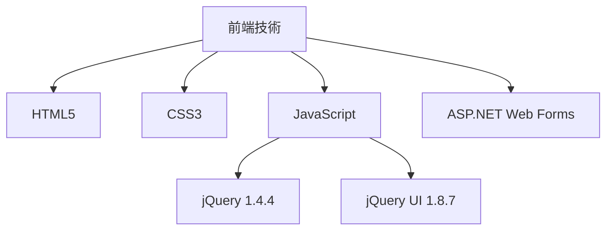
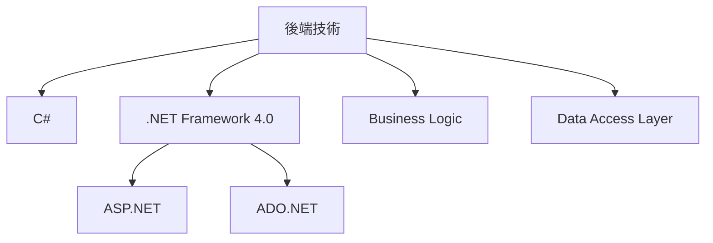
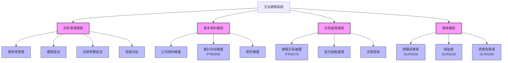
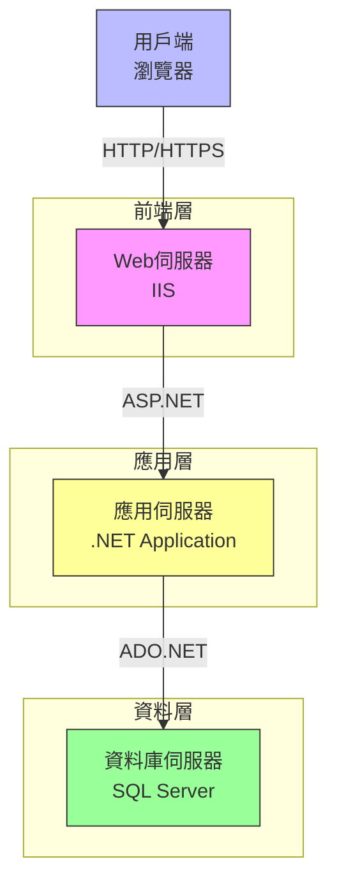

# 泛太總帳系統規格書 (視覺化版)

## 1. 基本資訊

| 項目 | 說明 |
|-----|------|
| 系統名稱 | 泛太總帳系統 |
| 系統代號 | GLATEST |
| 版本號碼 | 1.0.0 |
| 建立日期 | 2023/11/05 |
| 建立人員 | PanPacific開發團隊 |
| 最後修改日期 | 2023/11/05 |
| 最後修改人員 | PanPacific開發團隊 |

## 2. 系統概述

### 2.1 系統目的

泛太總帳系統旨在提供完整的財務會計管理解決方案，支援企業進行會計科目管理、交易記錄、財務報表生成及分析等功能。系統以Web架構實現，確保使用者可透過瀏覽器便捷存取，並提供高度客製化的報表與分析工具。

  

### 2.2 系統特點

  <table>
    <tr>
      <td align="center"> Web架構</td>
      <td align="center"> 多層架構</td>
      <td align="center"> 會計週期管理</td>
      <td align="center"> 豐富報表</td>
    </tr>
    <tr>
      <td align="center"> 多語系支援</td>
      <td align="center"> 權限管理</td>
      <td align="center"> 資料維護</td>
      <td align="center"> 安全控管</td>
    </tr>
  </table>

1. **基於ASP.NET框架開發的Web應用程式**
   - 支援跨瀏覽器操作
   - 無需安裝用戶端軟體
   - 統一的部署與升級管理

2. **採用多層架構設計**
   - 表現層 (UI Layer)
   - 業務邏輯層 (Business Logic Layer)
   - 資料存取層 (Data Access Layer)
   - 確保系統可維護性與擴展性

3. **支援完整的會計週期管理**
   - 會計年度設定
   - 期間管理
   - 交易記錄
   - 結轉處理
   - 財務報表產生

4. **提供豐富的財務報表與分析工具**
   - 標準會計報表
   - 自訂報表功能
   - 圖表分析工具
   - 匯出多種格式

5. **多語系支援（繁體中文/英文）**
   - 使用者介面多語系切換
   - 報表多語系輸出
   - 資料多語系維護

6. **整合式的使用者權限管理**
   - 角色型權限控制
   - 功能層級權限
   - 資料層級權限
   - 操作稽核記錄

7. **完善的資料維護與查詢功能**
   - 直覺化的操作介面
   - 彈性化的查詢條件
   - 批次資料處理
   - 資料匯入/匯出

8. **資料安全性控管**
   - 加密傳輸
   - 敏感資料保護
   - 資料庫安全備份
   - 操作日誌追蹤

### 2.3 使用對象

  

| 使用者角色 | 主要職責 | 使用系統功能 |
|----------|---------|------------|
| **財務部門人員** | 日常財務資料處理 | 交易維護、資料查詢、報表產生 |
| **會計人員** | 會計資料錄入與維護 | 科目維護、分錄處理、報表審核 |
| **財務主管** | 財務決策與審核 | 報表分析、交易審核、績效評估 |
| **稽核人員** | 財務資料查核與稽核 | 查詢功能、稽核報表、歷史記錄 |
| **系統管理員** | 系統設定與維護 | 使用者管理、權限設定、系統參數 |

## 3. 系統架構

### 3.1 技術架構

  

#### 3.1.1 前端技術

- **HTML5**：頁面結構與內容
- **CSS3**：視覺呈現與版面布局
  - iBOSSiteStyle.css：主要樣式表
  - iBosGridStyle.css：表格樣式表
  - StyleBtn.css：按鈕樣式表
- **JavaScript**：前端互動功能
  - jQuery 1.4.4：DOM操作與AJAX
  - jQuery UI 1.8.7：界面元件與特效
  - ui.datepicker.js：日期選擇功能
  - ui.datepicker.tw.js：民國年日期選擇
- **ASP.NET Web Forms**：頁面框架
  - Master Pages：頁面模板
  - User Controls：共用控制項
  - Validation Controls：資料驗證

#### 3.1.2 後端技術

- **C#**：主要開發語言
- **.NET Framework 4.0**：應用程式框架
  - ASP.NET：Web應用程式框架
  - ADO.NET：資料存取技術
- **Business Logic**：業務邏輯層
  - 交易處理邏輯
  - 資料驗證邏輯
  - 權限檢查邏輯
- **Data Access Layer**：資料存取層
  - SQL命令封裝
  - 交易管理
  - 連接池管理

#### 3.1.3 資料庫

- **Microsoft SQL Server**：主要資料庫系統
  - 版本：SQL Server 2016及以上
  - 功能：
    - 資料儲存
    - 交易管理
    - 資料備份與恢復
    - 安全控管

#### 3.1.4 開發環境

- **Visual Studio**：IDE開發環境
  - 版本：Visual Studio 2019及以上
  - 功能：
    - 程式碼編輯
    - 除錯工具
    - 部署工具
- **SQL Server Management Studio**：資料庫管理工具
  - 版本：SSMS 18.0及以上
  - 功能：
    - 資料庫設計
    - 查詢工具
    - 效能監控 

### 3.2 系統模組

  

#### 3.2.1 系統管理模組

  <table border="0">
    <tr>
      <td align="center">
         
        <b>使用者管理</b> 
        帳號控管、角色指派
      </td>
      <td align="center">
         
        <b>權限設定</b> 
        功能、資料存取權限
      </td>
    </tr>
    <tr>
      <td align="center">
         
        <b>系統參數設定</b> 
        會計期間、日期格式
      </td>
      <td align="center">
         
        <b>系統日誌</b> 
        操作記錄、錯誤監控
      </td>
    </tr>
  </table>

#### 3.2.2 基本資料模組

  <table border="0">
    <tr>
      <td align="center">
         
        <b>公司資料維護</b> 
        基本資料、組織架構
      </td>
      <td align="center">
         
        <b>會計科目維護</b> 
        科目管理、階層設定
      </td>
      <td align="center">
         
        <b>幣別維護</b> 
        匯率設定、換算規則
      </td>
    </tr>
  </table>

#### 3.2.3 交易處理模組

  <table border="0">
    <tr>
      <td align="center">
         
        <b>總帳交易維護</b> 
        分錄建立、批次匯入
      </td>
      <td align="center">
         
        <b>批次過帳處理</b> 
        審核確認、期末結轉
      </td>
      <td align="center">
         
        <b>交易查詢</b> 
        歷史查詢、明細瀏覽
      </td>
    </tr>
  </table>

#### 3.2.4 報表模組

  <table border="0">
    <tr>
      <td align="center">
         
        <b>餘額試算表</b> 
        科目彙總、期間比較
      </td>
      <td align="center">
         
        <b>損益表</b> 
        收支對比、預算分析
      </td>
      <td align="center">
         
        <b>資產負債表</b> 
        資產負債、比率分析
      </td>
    </tr>
  </table>

### 3.3 物理架構

  

#### 3.3.1 前端層

- **Web伺服器**：IIS (Internet Information Services)
  - 版本：IIS 10或以上
  - 功能：
    - HTTP/HTTPS請求處理
    - 靜態資源管理
    - 負載平衡
    - SSL加密通訊
  - 配置要求：
    - 處理器：4核心以上
    - 記憶體：8GB以上
    - 硬碟：100GB以上

#### 3.3.2 應用層

- **應用邏輯處理**
  - 使用者請求處理
  - 業務流程實現
  - 事務管理
  - 資料驗證

- **業務規則實現**
  - 會計原則enforcement
  - 內部控制檢核
  - 資料一致性檢查
  - 系統權限控管

- **資料存取接口**
  - 封裝SQL存取
  - 連接池管理
  - 查詢優化
  - 緩存策略

#### 3.3.3 資料層

- **資料庫伺服器**：SQL Server
  - 版本：SQL Server 2016或以上
  - 功能：
    - 資料儲存與檢索
    - 關聯式資料庫服務
    - 索引與查詢優化
    - 交易控制
  - 配置要求：
    - 處理器：8核心以上
    - 記憶體：16GB以上
    - 硬碟：500GB以上 (SSD)

- **資料安全控管**
  - 存取權限管理
  - 資料加密
  - 稽核追蹤
  - 資料備份與恢復

## 4. 主要功能

### 4.1 系統管理功能

  

#### 4.1.1 使用者管理

  <table>
    <tr>
      <th>功能項目</th>
      <th>功能說明</th>
      <th>操作頻率</th>
      <th>使用角色</th>
    </tr>
    <tr>
      <td>使用者建立與維護</td>
      <td>
        - 新增使用者帳號 
        - 編輯使用者資料 
        - 停用/啟用使用者 
        - 使用者資料查詢
      </td>
      <td>低 (as needed)</td>
      <td>系統管理員</td>
    </tr>
    <tr>
      <td>角色設定與權限指派</td>
      <td>
        - 建立角色 
        - 設定角色權限 
        - 指派使用者角色 
        - 角色權限查詢
      </td>
      <td>低 (as needed)</td>
      <td>系統管理員</td>
    </tr>
    <tr>
      <td>密碼政策管理</td>
      <td>
        - 密碼複雜度要求 
        - 密碼有效期限 
        - 密碼更換提醒 
        - 密碼重置
      </td>
      <td>低 (as needed)</td>
      <td>系統管理員</td>
    </tr>
  </table>

  
  
<small>使用者管理畫面示意圖</small>

#### 4.1.2 權限設定

  <table>
    <tr>
      <th>功能項目</th>
      <th>功能說明</th>
      <th>操作頻率</th>
      <th>使用角色</th>
    </tr>
    <tr>
      <td>功能權限控管</td>
      <td>
        - 模組功能權限 
        - 操作按鈕權限 
        - 批次作業權限 
        - 報表產生權限
      </td>
      <td>低 (as needed)</td>
      <td>系統管理員</td>
    </tr>
    <tr>
      <td>資料存取權限控管</td>
      <td>
        - 公司資料存取權限 
        - 科目資料存取權限 
        - 交易資料存取權限 
        - 報表資料存取權限
      </td>
      <td>低 (as needed)</td>
      <td>系統管理員</td>
    </tr>
    <tr>
      <td>報表權限控管</td>
      <td>
        - 報表檢視權限 
        - 報表匯出權限 
        - 報表列印權限 
        - 報表格式設定權限
      </td>
      <td>低 (as needed)</td>
      <td>系統管理員</td>
    </tr>
  </table>

  
  
<small>權限管理畫面示意圖</small>

#### 4.1.3 系統參數設定

  <table>
    <tr>
      <th>功能項目</th>
      <th>功能說明</th>
      <th>操作頻率</th>
      <th>使用角色</th>
    </tr>
    <tr>
      <td>系統基本參數</td>
      <td>
        - 系統標題設定 
        - 預設顯示筆數 
        - 工作階段逾時 
        - 介面語言設定
      </td>
      <td>低 (as needed)</td>
      <td>系統管理員</td>
    </tr>
    <tr>
      <td>會計期間設定</td>
      <td>
        - 會計年度起始月 
        - 期間開啟/關閉 
        - 年度結轉設定 
        - 期間鎖定/解鎖
      </td>
      <td>中 (每年/每月)</td>
      <td>系統管理員 財務主管</td>
    </tr>
    <tr>
      <td>日期格式設定</td>
      <td>
        - 民國年/西元年選擇 
        - 日期顯示格式 
        - 日期輸入格式 
        - 預設日期範圍
      </td>
      <td>低 (as needed)</td>
      <td>系統管理員</td>
    </tr>
  </table>

  
  
<small>系統參數設定畫面示意圖</small>

#### 4.1.4 系統日誌

  <table>
    <tr>
      <th>功能項目</th>
      <th>功能說明</th>
      <th>操作頻率</th>
      <th>使用角色</th>
    </tr>
    <tr>
      <td>操作日誌記錄</td>
      <td>
        - 使用者登入/登出記錄 
        - 功能操作記錄 
        - 資料變更記錄 
        - 使用者活動追蹤
      </td>
      <td>低 (as needed)</td>
      <td>系統管理員 稽核人員</td>
    </tr>
    <tr>
      <td>錯誤日誌記錄</td>
      <td>
        - 系統錯誤記錄 
        - 應用程式例外 
        - 資料庫錯誤 
        - 安全性異常
      </td>
      <td>低 (as needed)</td>
      <td>系統管理員</td>
    </tr>
    <tr>
      <td>系統事件監控</td>
      <td>
        - 系統效能監控 
        - 資源使用狀況 
        - 關鍵事件通知 
        - 系統健康狀態
      </td>
      <td>低 (as needed)</td>
      <td>系統管理員</td>
    </tr>
  </table>

  
  
<small>系統日誌畫面示意圖</small>

### 4.2 基本資料功能

  

#### 4.2.1 公司資料維護

  <table>
    <tr>
      <th>功能項目</th>
      <th>功能說明</th>
      <th>操作頻率</th>
      <th>使用角色</th>
    </tr>
    <tr>
      <td>公司基本資料建立與維護</td>
      <td>
        - 公司代碼與名稱設定 
        - 公司基本聯絡資訊 
        - 統一編號與地址資料 
        - 公司狀態管理
      </td>
      <td>低 (as needed)</td>
      <td>系統管理員 財務主管</td>
    </tr>
    <tr>
      <td>組織架構設定</td>
      <td>
        - 部門資料維護 
        - 部門階層關係 
        - 部門主管設定 
        - 部門狀態管理
      </td>
      <td>低 (as needed)</td>
      <td>系統管理員 財務主管</td>
    </tr>
    <tr>
      <td>交易控制參數設定</td>
      <td>
        - 交易編號規則 
        - 預設交易類型 
        - 審核流程設定 
        - 過帳控制參數
      </td>
      <td>低 (as needed)</td>
      <td>系統管理員 財務主管</td>
    </tr>
  </table>

  
  
<small>公司資料維護畫面示意圖</small>

#### 4.2.2 會計科目維護 (PTA0150)

  <table>
    <tr>
      <th>功能項目</th>
      <th>功能說明</th>
      <th>操作頻率</th>
      <th>使用角色</th>
    </tr>
    <tr>
      <td>會計科目建立與維護</td>
      <td>
        - 科目代碼與名稱設定 
        - 科目狀態管理 
        - 科目查詢與篩選 
        - 科目複製功能
      </td>
      <td>中 (as needed)</td>
      <td>會計人員 財務主管</td>
    </tr>
    <tr>
      <td>科目階層關係設定</td>
      <td>
        - 上層科目指定 
        - 子科目管理 
        - 科目層級設定 
        - 匯總科目管理
      </td>
      <td>中 (as needed)</td>
      <td>會計人員 財務主管</td>
    </tr>
    <tr>
      <td>科目類型與屬性設定</td>
      <td>
        - 資產負債表類型 
        - 損益表類型 
        - 科目屬性設定 
        - 計算方式設定
      </td>
      <td>中 (as needed)</td>
      <td>會計人員 財務主管</td>
    </tr>
    <tr>
      <td>預設分錄設定</td>
      <td>
        - 預設對應科目 
        - 分錄模板設定 
        - 自動分錄規則 
        - 期末處理預設值
      </td>
      <td>低 (as needed)</td>
      <td>會計人員 財務主管</td>
    </tr>
  </table>

  
  
<small>會計科目維護畫面示意圖</small>

  
  
<small>科目階層關係示意圖</small>

#### 4.2.3 幣別維護

  <table>
    <tr>
      <th>功能項目</th>
      <th>功能說明</th>
      <th>操作頻率</th>
      <th>使用角色</th>
    </tr>
    <tr>
      <td>幣別資料建立與維護</td>
      <td>
        - 幣別代碼與名稱 
        - 幣別符號設定 
        - 小數位數設定 
        - 幣別狀態管理
      </td>
      <td>低 (as needed)</td>
      <td>財務主管 系統管理員</td>
    </tr>
    <tr>
      <td>匯率設定</td>
      <td>
        - 基準幣別設定 
        - 匯率資料維護 
        - 歷史匯率查詢 
        - 匯率批次匯入
      </td>
      <td>高 (daily/weekly)</td>
      <td>會計人員 財務主管</td>
    </tr>
    <tr>
      <td>匯率換算規則設定</td>
      <td>
        - 匯率換算方式 
        - 匯率進位設定 
        - 特殊匯率處理 
        - 交叉匯率計算
      </td>
      <td>低 (as needed)</td>
      <td>財務主管 系統管理員</td>
    </tr>
  </table>

  
  
<small>幣別維護畫面示意圖</small>

### 4.3 交易處理功能

  

#### 4.3.1 總帳交易維護 (PTA0170)

  <table>
    <tr>
      <th>功能項目</th>
      <th>功能說明</th>
      <th>操作頻率</th>
      <th>使用角色</th>
    </tr>
    <tr>
      <td>會計分錄建立與維護</td>
      <td>
        - 分錄頭資料維護 
        - 分錄明細維護 
        - 借貸平衡檢查 
        - 分錄草稿功能
      </td>
      <td>高 (daily)</td>
      <td>會計人員</td>
    </tr>
    <tr>
      <td>分錄批次匯入</td>
      <td>
        - Excel資料匯入 
        - 匯入資料檢核 
        - 錯誤處理機制 
        - 匯入歷史查詢
      </td>
      <td>中 (weekly/monthly)</td>
      <td>會計人員</td>
    </tr>
    <tr>
      <td>分錄複製與修改</td>
      <td>
        - 分錄複製功能 
        - 分錄修改追蹤 
        - 分錄反轉功能 
        - 分錄樣板套用
      </td>
      <td>中 (as needed)</td>
      <td>會計人員</td>
    </tr>
    <tr>
      <td>交易審核與過帳</td>
      <td>
        - 分錄審核流程 
        - 分錄退回處理 
        - 單筆交易過帳 
        - 過帳結果確認
      </td>
      <td>高 (daily)</td>
      <td>會計人員 財務主管</td>
    </tr>
  </table>

  
  
<small>總帳交易維護畫面示意圖</small>

  
  
<small>交易處理流程示意圖</small>

#### 4.3.2 批次過帳處理

  <table>
    <tr>
      <th>功能項目</th>
      <th>功能說明</th>
      <th>操作頻率</th>
      <th>使用角色</th>
    </tr>
    <tr>
      <td>批次分錄審核</td>
      <td>
        - 批次選取功能 
        - 批次檢核規則 
        - 錯誤清單產生 
        - 批次審核記錄
      </td>
      <td>中 (daily/weekly)</td>
      <td>財務主管</td>
    </tr>
    <tr>
      <td>批次過帳處理</td>
      <td>
        - 過帳條件設定 
        - 批次資料檢核 
        - 過帳執行控制 
        - 過帳結果報表
      </td>
      <td>中 (daily/weekly)</td>
      <td>財務主管</td>
    </tr>
    <tr>
      <td>期末結轉處理</td>
      <td>
        - 期末結轉參數 
        - 損益科目結轉 
        - 結轉檢核報表 
        - 結轉記錄查詢
      </td>
      <td>低 (monthly)</td>
      <td>財務主管</td>
    </tr>
    <tr>
      <td>年度結轉處理</td>
      <td>
        - 年度結轉參數 
        - 保留盈餘處理 
        - 新年度初始化 
        - 年度結轉記錄
      </td>
      <td>低 (yearly)</td>
      <td>財務主管</td>
    </tr>
  </table>

  
  
<small>批次過帳處理畫面示意圖</small>

#### 4.3.3 交易查詢

  <table>
    <tr>
      <th>功能項目</th>
      <th>功能說明</th>
      <th>操作頻率</th>
      <th>使用角色</th>
    </tr>
    <tr>
      <td>交易歷史查詢</td>
      <td>
        - 多條件查詢 
        - 歷史交易瀏覽 
        - 交易摘要顯示 
        - 交易狀態查詢
      </td>
      <td>高 (daily)</td>
      <td>會計人員 稽核人員</td>
    </tr>
    <tr>
      <td>交易明細查詢</td>
      <td>
        - 科目明細查詢 
        - 過帳明細查詢 
        - 明細資料匯出 
        - 自訂查詢條件
      </td>
      <td>高 (daily)</td>
      <td>會計人員 稽核人員</td>
    </tr>
    <tr>
      <td>未過帳交易查詢</td>
      <td>
        - 待審核交易查詢 
        - 已審核未過帳查詢 
        - 錯誤交易查詢 
        - 批次處理狀態
      </td>
      <td>高 (daily)</td>
      <td>會計人員 財務主管</td>
    </tr>
    <tr>
      <td>交易批號查詢</td>
      <td>
        - 批號條件查詢 
        - 批次匯入記錄 
        - 批次處理記錄 
        - 異常交易分析
      </td>
      <td>中 (as needed)</td>
      <td>會計人員 稽核人員</td>
    </tr>
  </table>

  
  
<small>交易查詢畫面示意圖</small>

### 4.4 報表功能

  

#### 4.4.1 餘額試算表 (GLR0220)

  <table>
    <tr>
      <th>功能項目</th>
      <th>功能說明</th>
      <th>操作頻率</th>
      <th>使用角色</th>
    </tr>
    <tr>
      <td>依科目層級彙總</td>
      <td>
        - 科目層級選擇 
        - 上層科目彙總 
        - 展開/摺疊檢視 
        - 零餘額隱藏選項
      </td>
      <td>高 (daily/weekly)</td>
      <td>會計人員 財務主管</td>
    </tr>
    <tr>
      <td>多種顯示格式</td>
      <td>
        - 標準T型格式 
        - 清單式格式 
        - 對比式格式 
        - 自訂欄位顯示
      </td>
      <td>高 (daily/weekly)</td>
      <td>會計人員 財務主管</td>
    </tr>
    <tr>
      <td>期間比較功能</td>
      <td>
        - 期初/期末餘額比較 
        - 本期/上期餘額比較 
        - 同期比較 
        - 變動金額與比率
      </td>
      <td>中 (monthly)</td>
      <td>會計人員 財務主管</td>
    </tr>
    <tr>
      <td>匯出至Excel/PDF</td>
      <td>
        - Excel格式匯出 
        - PDF格式匯出 
        - 列印格式設定 
        - 自動郵件發送
      </td>
      <td>高 (daily/weekly)</td>
      <td>會計人員 財務主管</td>
    </tr>
  </table>

  
  
<small>餘額試算表畫面示意圖</small>

#### 4.4.2 損益表 (GLR0230)

  <table>
    <tr>
      <th>功能項目</th>
      <th>功能說明</th>
      <th>操作頻率</th>
      <th>使用角色</th>
    </tr>
    <tr>
      <td>自訂格式設定</td>
      <td>
        - 格式模板選擇 
        - 科目顯示順序 
        - 標題與小計設定 
        - 欄位顯示控制
      </td>
      <td>中 (as needed)</td>
      <td>會計人員 財務主管</td>
    </tr>
    <tr>
      <td>期間比較分析</td>
      <td>
        - 單一期間顯示 
        - 多期間對比 
        - 累計數字分析 
        - 同期比較功能
      </td>
      <td>高 (monthly)</td>
      <td>會計人員 財務主管</td>
    </tr>
    <tr>
      <td>預算比較分析</td>
      <td>
        - 實際與預算對比 
        - 差異分析 
        - 達成率計算 
        - 圖表視覺化
      </td>
      <td>中 (monthly)</td>
      <td>財務主管</td>
    </tr>
    <tr>
      <td>匯出至Excel/PDF</td>
      <td>
        - Excel格式匯出 
        - PDF格式匯出 
        - 列印格式設定 
        - 自動郵件發送
      </td>
      <td>高 (monthly)</td>
      <td>會計人員 財務主管</td>
    </tr>
  </table>

  
  
<small>損益表畫面示意圖</small>

#### 4.4.3 資產負債表 (GLR0240)

  <table>
    <tr>
      <th>功能項目</th>
      <th>功能說明</th>
      <th>操作頻率</th>
      <th>使用角色</th>
    </tr>
    <tr>
      <td>自訂格式設定</td>
      <td>
        - 格式模板選擇 
        - 科目排序規則 
        - 分組與小計設定 
        - 顯示層級控制
      </td>
      <td>中 (as needed)</td>
      <td>會計人員 財務主管</td>
    </tr>
    <tr>
      <td>期間比較分析</td>
      <td>
        - 期末餘額對比 
        - 多期間比較 
        - 變動金額計算 
        - 變動比率分析
      </td>
      <td>高 (monthly)</td>
      <td>會計人員 財務主管</td>
    </tr>
    <tr>
      <td>匯出至Excel/PDF</td>
      <td>
        - Excel格式匯出 
        - PDF格式匯出 
        - 列印格式設定 
        - 自動郵件發送
      </td>
      <td>高 (monthly)</td>
      <td>會計人員 財務主管</td>
    </tr>
    <tr>
      <td>財務比率分析</td>
      <td>
        - 流動比率計算 
        - 負債比率計算 
        - 資產周轉率 
        - 自訂比率計算
      </td>
      <td>中 (monthly)</td>
      <td>財務主管</td>
    </tr>
  </table>

  
  
<small>資產負債表畫面示意圖</small>

## 5. 畫面規格

### 5.1 主要畫面

  

#### 5.1.1 系統主版面 (GLA.master)

  
  
<small>系統主版面示意圖</small>

**主要特點**:
- 提供系統整體框架與選單導航
- 包含使用者認證、權限控制與工作階段管理
- 基於ASP.NET Master Page實作
- 提供完整側邊選單與頂部導航功能
- 統一系統外觀與操作體驗

**主要元件**:
- 頂部標題區域 (Header)
- 側邊選單區域 (Side Menu)
- 主要內容區域 (Main Content)
- 頁尾資訊區域 (Footer)
- 系統工具列 (System Toolbar)

**使用場景**:
- 系統主要功能頁面
- 資料瀏覽與查詢頁面
- 主要操作頁面
- 報表與分析頁面

#### 5.1.2 詳細內容頁主版面 (GLADetail.master)

  
  
<small>詳細內容頁主版面示意圖</small>

**主要特點**:
- 用於顯示詳細資料與表單操作
- 適用於彈出視窗與專注型操作介面
- 簡化版面，無側邊選單，專注內容呈現
- 提供回首頁按鈕，便於返回主界面
- 專注於單一任務的完成

**主要元件**:
- 簡化標題區域 (Simple Header)
- 詳細標題列 (Detail Title)
- 主要內容區域 (Main Content)
- 簡化頁尾區域 (Simple Footer)
- 操作按鈕區域 (Action Buttons) 